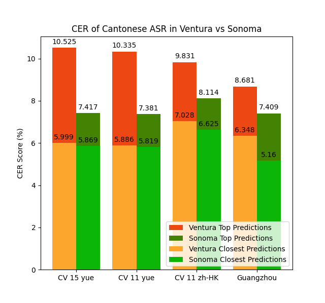
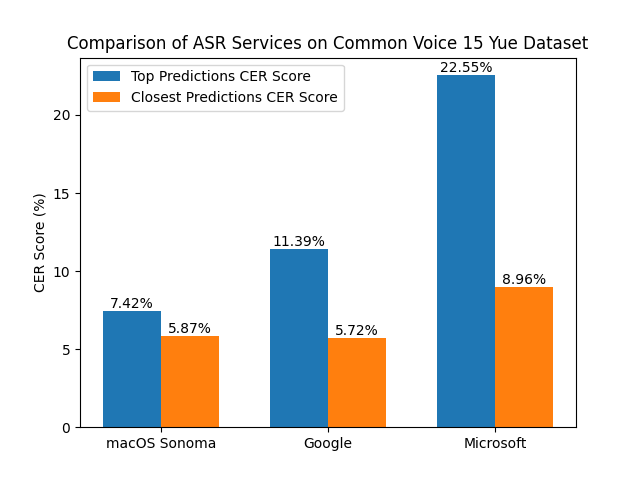
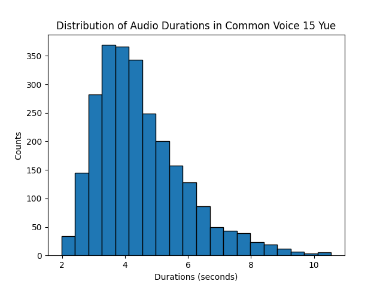
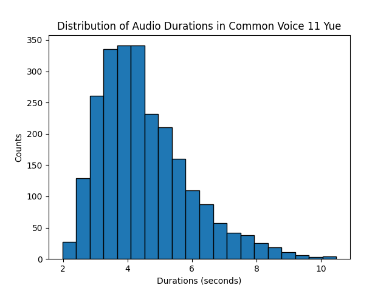
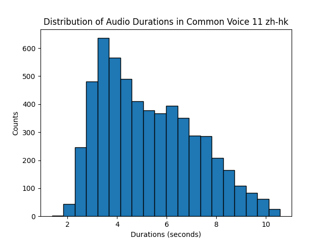
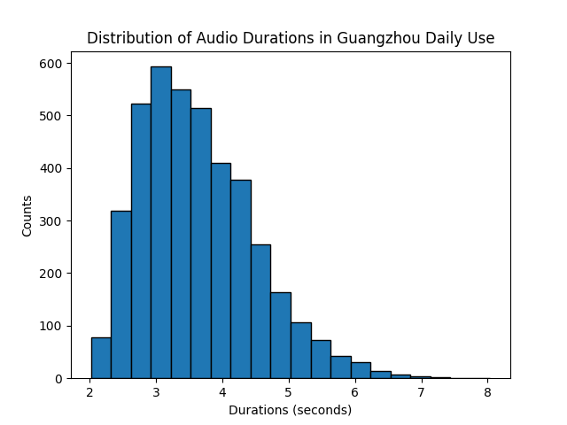

# Evaluation of Apple's Cantonese speech recognition on Common Voice

## Summary

The new upgrade for iOS/macOS claims to improve the accuracy of dictation, and some people online have commented that Cantonese dictation has also improved, but there is no data-drive comparison. To confirm Apple's claim, I selected three publicly available Cantonese phonetic databases for testing, comparing CERs before and after upgrade. The test results were a maximum 30% decrease in CER, a significant improvement in the ASR model's ability to select words (as measured by top predictions), and a significant improvement in the comprehensive ability to recognize the Guangzhou dialect. Apple's new model performs better than Google and Microsoft's cloud ASR, with CER 35% lower than Google and 67% lower than Microsoft. The model runs entirely on-device and is significantly faster after the upgrade (tested on M1 Max macBook Pro).

MDCC, one of the largest public Cantonese voice dataset, used Google cloud API to do the first round of annotation. If you need to do this kind of annotation in the future, however, you can also consider choosing macOS ASR for higher accuracy, faster processing, and free on-device recognition. 

Cantonese summary:

iOS/macOS嘅新upgrade聲稱提升咗dictation嘅準確率，網上有人評價話廣東話dictation都有所進步，但係冇一個data-driven嘅比較。為咗證實apple嘅claim，我揀咗三個公開嘅粵語語音數據庫嚟做測試，比較upgrade前後嘅CER。測試結果係CER有最高30%嘅下降，ASR模型嘅揀字能力大幅提升(as measured by top predictions)，綜合能力喺廣州話方言似乎都有顯著提升(as measured by closest predictions)。相比google同microsoft嘅cloud ASR，apple嘅新模型表現更佳，CER相比google要低35%，相比microsoft要低67%，而且喺macBook Pro上嘅運行速度都有顯著提升。

之前公開嘅MDCC數據庫係用google cloud api嚟做第一輪標注，我諗大家如果未來需要做語音數據庫都可以考慮揀macOS嘅ASR嚟做標注，佢嘅準確率高、速度快、仲係免費。 

## Introduction

I'm interested in developing a speech-powered Cantonese learning app for iOS but can't find qualitative evaluations of Apple's ASR model.
Hence, I conducted an evaluation on two versions of the Common Voice Yue dataset and one version of the Common Voice zh-HK dataset. Note that the Yue dataset contains purely colloquial Cantonese while the older zh-HK dataset contains a mixture of colloquial and formal language usages.

* **Common Voice 11 Yue**: Contains 2438 test audios.
    - Currenet state-of-the-art [simonl0909/whisper-large-v2-cantonese](https://huggingface.co/simonl0909/whisper-large-v2-cantonese) achieves a **6.727% CER**. However, Simon's model was trained on the Common Voice dataset so it might not be a fair comparison. The Common Voice dataset may be different from training data used for the Apple model, which can increase the recognition difficulty.
* **Common Voice 15 Yue**: The latest version of the dataset as of Sep 27, 2023. Contains 2560 test audios.
* **Common Voice 11 zh-HK**: Commonly used by open source ASR models for training and evaluation. Contains 5591 test audios.
    - Current [state-of-the-art developed by HKUST](https://arxiv.org/pdf/2201.02419.pdf) achieves a **7.65% CER**. However, HKUST's model was also trained on the Common Voice dataset along with their MDCC dataset so it might not be a fair comparison.

Two kinds of Character Error Rates are computed:
1. CER on the top prediction outputted by Apple's ASR
2. The minimum CER on all prediction candidates outputted by Apple's ASR. Or in other words, I pick the prediction candidate that has the closest levenshtein distance to the reference sentence and calculate its CER.

## macOS Ventura vs Sonoma



Here are the numbers obtained using macOS Ventura 13.6 (22G120) on a M1 Max macBook Pro:
| Dataset               | Top Predictions CER Score  | Closest Predictions CER Score |
|-----------------------|-----------------------------|-------------------------------|
| Common Voice 15 yue   | 10.525%                     | 5.999%                        |
| Common Voice 11 yue   | 10.335%                     | 5.886%                        |
| Common Voice 11 zh-HK | 9.831%                      | 7.028%                        |
| Guangzhou Daily Use   | 8.681%                      | 6.348%                        |

And here are the numbers obtained using macOS Sonoma 14.0 (23A344) on the same M1 Max macBook Pro:
| Dataset               | Top Predictions CER Score  | Closest Predictions CER Score |
|-----------------------|-----------------------------|-------------------------------|
| Common Voice 15 yue   | 7.417%                      | 5.869%                        |
| Common Voice 11 yue   | 7.381%                      | 5.819%                        |
| Common Voice 11 zh-HK | 8.114%                      | 6.625%                        |
| Guangzhou Daily Use   | 7.409%                      | 5.160%                        |

## macOS Sonoma vs Cloud APIs

For comparison, here are the results of macOS Sonoma speech API, Google Speech-to-text v1p1beta1, and Microsoft Cognitive Services Speech-to-text on the Common Voice 15 yue dataset:



| Dataset               | Top Predictions CER Score  | Closest Predictions CER Score |
|-----------------------|-----------------------------|-------------------------------|
| macOS Sonoma          | 7.417%                      | 5.869%                        |
| Google                | 11.392%                     | 5.718%                        |
| Microsoft             | 22.549%                     | 8.960%                        |

# Dataset statistics

## Audio durations










# Minor Preprocessing
For the zh-HK test set, we changed the ASCII double quotes to Chinese-style double quotes because of TSV parsing issues:
```
common_voice_zh-HK_23107405.mp3   同事找來一對桌上"小"揚聲器 => 同事找來一對桌上“小”揚聲器
```

When calculating the WER, we always strip away the punctuations first.
The Guangzhou Daily Use corpus uses uncommon character variants of two Cantonese particles so we replace all such characters
with their canonical forms.
```
噶 => 㗎
咧 => 呢
```
